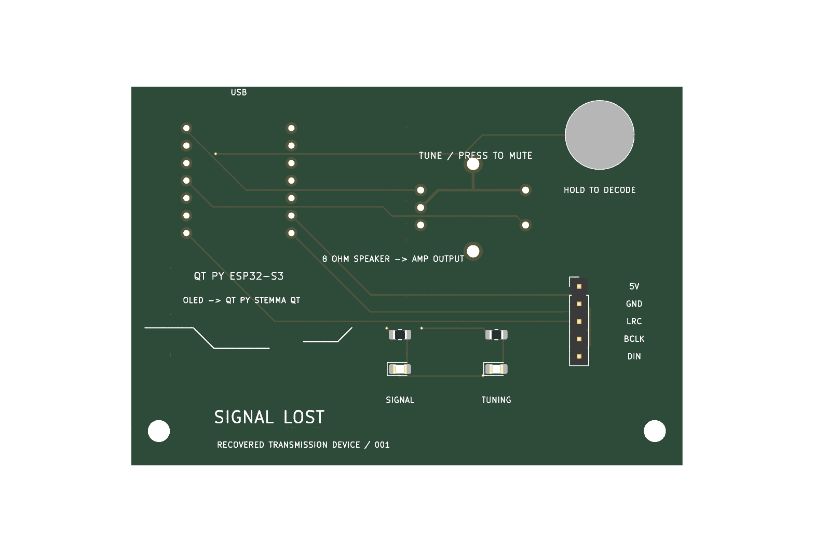
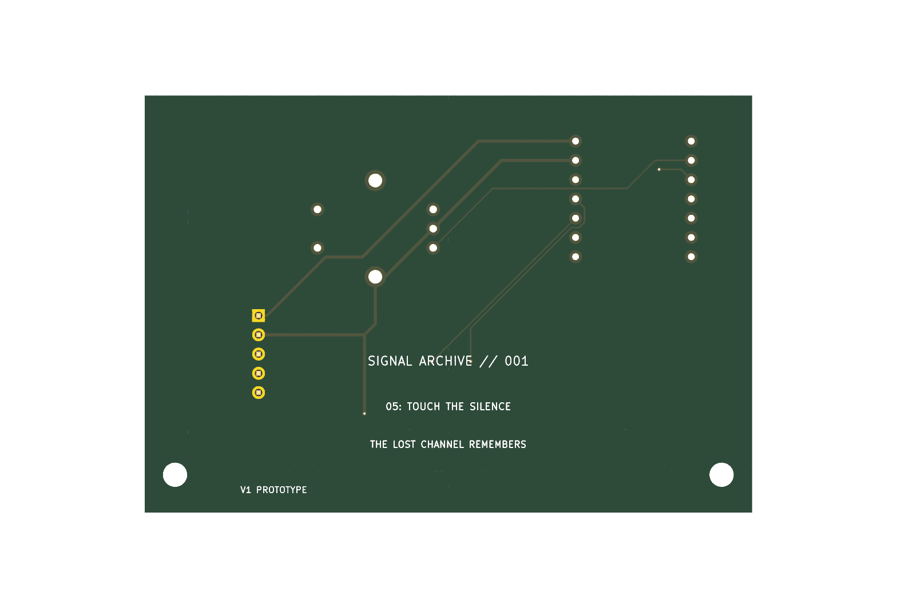

# signal-lost
Signal Lost: an interactive PCB radio that tunes into fictional transmissions

## Engineering prototype

This repository includes an AI-assisted KiCad carrier PCB design and prototype firmware. The schematic has zero ERC errors or warnings, the board has zero DRC errors and zero unconnected pads with one touch-pad silkscreen warning, and the firmware compiles. The hardware has not been assembled or physically tested.

- [Editable KiCad project](signal-lost.kicad_pro), [schematic](signal-lost.kicad_sch), and [PCB](signal-lost.kicad_pcb)
- [Schematic PDF](schematic.pdf)
- [Firmware source and PlatformIO configuration](firmware/)
- [Parts list](bom-signal-lost.csv)
- [Gerbers and drill files](gerbers/) and [fabrication ZIP](signal-lost-gerbers.zip)
- [Assembly details, references, and remaining work](DESIGN_NOTES.md)
- [KiCad verification reports](verification/)
- [Complete design package](signal-lost-design-package.zip)

The amplifier, speaker, and OLED are external modules connected to the carrier. The enclosure and illuminated cutouts remain to be designed. Journal entries should record work actually performed by the project author.
